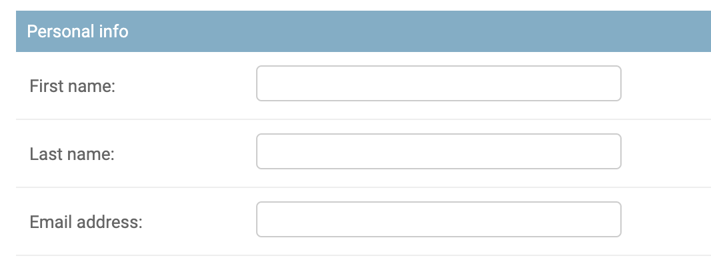

# 2019.12.12 목요일

### :movie_camera: Django

- **#3.0 ~ #3.6 User App**

  - [AUTH_USER_MODEL](https://docs.djangoproject.com/en/2.2/topics/auth/customizing/#substituting-a-custom-user-model)
    - 기존 장고에서 제공하는 users모델 오버라이드함.
    - 이전에는 INSTALLED_APPS 에 그냥 app 이름만 적었던것 같은데, config로 적는다.
  - Models
    - 필드를 추가할 경우, default로 임의의 값을 넣어주거나, null = True 로 해서 이미 추가되어 있는 데이터에 생성한 필드 값을 넣어줘야 한다.
    - blank = True를 하면, admin에서 from으로 데이터를 전송할 때 값을 입력하지 않아도 required 에러가 나지 않는다.
    - ImageField()
      - Pillow라는 라이브러리 설치가 필요하다.
    - CharField
      - max_length(글자수제한)을 설정해줘야 한다.
      - 선택 값(choices)를 생성할 수 있다. -> choice생성후 마이그레이션 할 필요 없음.
  - 어드민에서 기존 User 와 동일한 형태의 UI 사용하기

    ```python
    from django.contrib.auth.admin import UserAdmin

    @admin.register(models.User)
    class CustomUserAdmin(UserAdmin):

        """Custom User Admin"""
    ```

  - 어드민 fieldset
    - 
    - 기존 user field set을 유지한 채 사용자가 추가한 필드를 추가해줌.
    ```python
    fieldsets = UserAdmin.fieldsets + (
        (
            "이름",
            {
                "fields": (
                    // 필드 이름
                )
            },
        ),
    )
    ```

- **#4.0 ~ #4.5 Room App**

  - Meta 클래스
    - abstract
      - 모델이지만 데이터베이스에는 나타나지 않는 모델
      - 확장하기 위해 사용  
        즉, 테이블마다 created, updated 필드가 공통적으로 필요한 경우 abstract 모델을 만들어서 테이블마다 추가해주면 된다.
  - DateTimeField
    - auto_now : 모델을 save 할 때 날짜, 시간을 갖고와서 자동 입력
    - auto_now_add : 모델을 생성할 때마다 수시로 자동 업데이트
    ```python
    created = models.DateTimeField(auto_now_add=True)
    updated = models.DateTimeField(auto_now=True)
    ```
  - ManyToManyField : 다대다 관계
  - ForeignKey : 외래키 (일대다)

    - 파이썬은 순차적으로 코드를 읽기 때문에, 아래와 같이 작성한 경우 오래 발생

    ```python
    # Photo가 Room보다 먼저 선언되었기 때문에 오류 발생
    class Photo(core_models.TimeStampedModel):
      room = models.ForeignKey(Room,on_delete=models.CASCADE)

    class Room(core_models.TimeStampedModel):
       ...
    ```

    이련 경우, Photo클래스를 Room클래스 뒤로 옮기거나, 아래와 같이 **String(문자열)**로 변경해 주면 된다.

    ```python
    # 문자열로 변경
    class Photo(core_models.TimeStampedModel):
      room = models.ForeignKey("Room",on_delete=models.CASCADE)

    class Room(core_models.TimeStampedModel):
       ...
    ```
